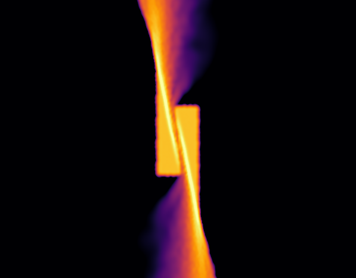

#  TDE OUTCRON

<div id="top"></div>
<!--
*** README template is from: https://github.com/othneildrew/Best-README-Template
-->


<!-- PROJECT SHIELDS -->
<!--
*** I'm using markdown "reference style" links for readability.
*** Reference links are enclosed in brackets [ ] instead of parentheses ( ).
*** See the bottom of this document for the declaration of the reference variables
*** for contributors-url, forks-url, etc. This is an optional, concise syntax you may use.
*** https://www.markdownguide.org/basic-syntax/#reference-style-links
-->
 <!-- [![Contributors][contributors-shield]][contributors-url]
[![Forks][forks-shield]][forks-url]
[![Stargazers][stars-shield]][stars-url]
[![Issues][issues-shield]][issues-url]
  [![MIT License][license-shield]][license-url]
  [![LinkedIn][linkedin-shield]][linkedin-url] -->


<!-- PROJECT LOGO -->
<br />
<div align="center">
  <a href="https://github.com/othneildrew/Best-README-Template">
    
  </a>

  <h3 align="center">Stellar tidal disruption events and the OUTflow from the self-CRossing regiON (OUTCRON) for different values of SMBH's spin</h3>

  <p align="center">
    Inject particles in a self-crossing region like never before!
    <br />
     <!-- <a href="https://github.com/othneildrew/Best-README-Template"><strong>Explore the docs »</strong></a>  -->
    <br />
    <br />
   <!-- <a href="https://github.com/othneildrew/Best-README-Template">View Demo</a>  -->

[Report a bug or request a feature](https://github.com/tajjankovic/OUTCRON/issues).

  
 <!--   <a href="issues">Request Feature</a>  -->
  </p>
</div>


<!-- TABLE OF CONTENTS -->
<details>
  <summary>Table of Contents</summary>
  <ol>
    <li>
      <a href="#about-the-project">About The Project</a>
      <ul>
        <li><a href="#built-with">Built With</a></li>
      </ul>
    </li>
    <li>
      <a href="#getting-started">Getting Started</a>
      <ul>
        <li><a href="#prerequisites">Prerequisites</a></li>
        <li><a href="#installation">Installation</a></li>
      </ul>
    </li>
    <li><a href="#usage">Usage</a></li>
   <!-- <li><a href="#roadmap">Roadmap</a></li> -->
  <!--   <li><a href="#contributing">Contributing</a></li> -->
  <!--   <li><a href="#license">License</a></li> -->
    <li><a href="#contact">Contact</a></li>
    <li><a href="#acknowledgments">Acknowledgments</a></li>
  </ol>
</details>


<!-- ABOUT THE PROJECT -->
## About The Project

<!-- [![Product Name Screen Shot][product-screenshot]](https://example.com)  -->

In recent years, there have been several studies related to numerical simulations of TDEs ([[1]](#1), [[1]](#1), [[1]](#1), [[1]](#1), [[1]](#1), [[1]](#1)). However, due to severe computational restrictions, a global simulation of an entire TDE process with typical disruption parameters (impact parameter $\beta \sim 1$, parabolic orbit, mass of the supermassive black hole $M_\mathrm{bh}\sim 10^6 M_\odot$), ranging from the pre-disruption phase to the formation of the accretion disk, is not feasible. This numerical issue arises during the second passage, when the bound debris returns in the proximity of the SMBH. For typical disruption parameters  the bound debris is on a wide range of elliptical orbits. In this case, the head of the tidal stream, composed of the most bound debris, is not resolved due to high numerical requirements ([[1]](#1)). Therefore, the initial stages of the second passage as well as the self-crossing are not accurately simulated as the necessary resolution is several orders of magnitude larger, than the resolution used in TDE simulations. We simulate stellar tidal disruption events with a new approach, similar as in (([[1]](#1), ([[1]](#1)). The method is based on simulating conditions in the self-crossing region. In this way, the numerical issues are alleviated.


OUTCRON is based on we study the effect of SMBH's rotation by considering collisions between two streams that are offset in the direction perpendicular to the orbital plane of the debris. Simulations are based on a particle injection procedure close to the self-crossing region. We simulate the collision in a local frame moving with the tangential velocity of the collision outflow and validate our approach. 


OUTCRON is a program, which enables user to inject particles from a self-crossing region in stellar tidal disruption events. 

User should follow this simple steps:
* Specify dz.
* 
* 

The program will output a HEALPix map or ...

<p align="right">(<a href="#top">back to top</a>)</p>


### Built With

This section should list any major frameworks/libraries used to bootstrap your project. Leave any add-ons/plugins for the acknowledgements section. Here are a few examples.

* [healpy](https://healpy.readthedocs.io/en/latest/)
* [HEALPix](https://healpix.jpl.nasa.gov/)


<p align="right">(<a href="#top">back to top</a>)</p>


<!-- GETTING STARTED -->
## Getting Started

This is an example of how you may give instructions on setting up your project locally.
To get a local copy up and running follow these simple example steps.

### Prerequisites

This is an example of how to list things you need to use the software and how to install them.
* Python 3
  ```sh
  npm install npm@latest -g
  ```

### Installation

_Below is an example of how you can instruct your audience on installing and setting up your app. This template doesn't rely on any external dependencies or services._

1. Get a free API Key at [https://example.com](https://example.com)
2. Clone the repo
   ```sh
   git clone https://github.com/tajjankovic/OUTCRON.git
   ```
3. Install Pyhton packages
   ```sh
   pip install pandas
   ```

        ◦ INSTRUCTIONS FOR INSTALLATION:
            ▪ Tried on MacOS:
                • pip3 install matplotlib, pandas, healpy, 
                • brew install geos (for Basemap plots)
                • pip3 install pygeos
                • pip3 install basemap (maybe not necessary)
<p align="right">(<a href="#top">back to top</a>)</p>


<!-- USAGE EXAMPLES -->
## Usage
        ◦ Construct a Healpix map of f’ and coordinates phi’, theta’ of pixel centers (integral of f’ over unit sphere = 1)
            ▪ introduce f= dotM/dotM_tot and evaluate for every pixel
        ◦ Evaluate f for a 2D grid:
            ▪ construct grid:
                • linspace in phi, evenly spaced in cosine
            ▪ for every point in the grid (every pair of theta, phi) evaluate f by determining in which pixel is this pair located
            ▪ “correction factor” (integral of f over units sphere =1):
                • theta, phi have different spacing/distro than theta, phi → multiply with delta cos* delta phi
                • 
            ▪ output: theta,phi,f for every point
            ▪ What Clement thinks that it would be better???:
                • to have: f*delta_cos_theta = 1
                • so f = f’/pix_area (“normalized” mass flux – or how do we call it?)
                • from: 
                •         hpmap_out = np.take(hpxmap,pix_out)*delta_cos_theta*delta_phi/pix_area
                • to (and then multiply the sum by correction factor *delta_cos_theta/pix_area:
                •         hpmap_out = np.take(hpxmap,pix_out)
                
Use this space to show useful examples of how a project can be used. Additional screenshots, code examples and demos work well in this space. You may also link to more resources.

Running the program:

* From the command line:
   ```sh
   python3.8 outflow_final.py --dz_list 0.6 1.2
   ```
* 

Viewing the output:
* Plots:
* Data: 


Adjusting program parameters:

* Pyt
* 

   

<p align="right">(<a href="#top">back to top</a>)</p>


<!-- ROADMAP
## Roadmap

- [x] Add Changelog
- [x] Add back to top links
- [ ] Add Additional Templates w/ Examples
- [ ] Add "components" document to easily copy & paste sections of the readme
- [ ] Multi-language Support
    - [ ] Chinese
    - [ ] Spanish

See the [open issues](https://github.com/othneildrew/Best-README-Template/issues) for a full list of proposed features (and known issues).

<p align="right">(<a href="#top">back to top</a>)</p>  -->


<!-- CONTRIBUTING 
## Contributing

Contributions are what make the open source community such an amazing place to learn, inspire, and create. Any contributions you make are **greatly appreciated**.

If you have a suggestion that would make this better, please fork the repo and create a pull request. You can also simply open an issue with the tag "enhancement".
Don't forget to give the project a star! Thanks again!

1. Fork the Project
2. Create your Feature Branch (`git checkout -b feature/AmazingFeature`)
3. Commit your Changes (`git commit -m 'Add some AmazingFeature'`)
4. Push to the Branch (`git push origin feature/AmazingFeature`)
5. Open a Pull Request

<p align="right">(<a href="#top">back to top</a>)</p> -->


<!-- LICENSE 
## License

Distributed under the MIT License. See `LICENSE.txt` for more information.

<p align="right">(<a href="#top">back to top</a>)</p> -->


<!-- CONTACT -->
## Contact

Your Name - [@your_twitter](https://twitter.com/your_username) - email@example.com

Project Link: [https://github.com/your_username/repo_name](https://github.com/your_username/repo_name)

<p align="right">(<a href="#top">back to top</a>)</p>


<!-- ACKNOWLEDGMENTS -->
## References
<a id="1">[1]</a> 
Bonnerot C., Lu W., 2020, Monthly Notices of the Royal Astronomical Society.


<!-- Use this space to list resources you find helpful and would like to give credit to. I've included a few of my favorites to kick things off!

* [Choose an Open Source License](https://choosealicense.com)
* [GitHub Emoji Cheat Sheet](https://www.webpagefx.com/tools/emoji-cheat-sheet) -->

<p align="right">(<a href="#top">back to top</a>)</p>


<!-- MARKDOWN LINKS & IMAGES  -->
<!-- https://www.markdownguide.org/basic-syntax/#reference-style-links 
[contributors-shield]: https://img.shields.io/github/contributors/othneildrew/Best-README-Template.svg?style=for-the-badge

[license-shield]: https://img.shields.io/github/license/othneildrew/Best-README-Template.svg?style=for-the-badge
[license-url]: https://github.com/othneildrew/Best-README-Template/blob/master/LICENSE.txt
[linkedin-shield]: https://img.shields.io/badge/-LinkedIn-black.svg?style=for-the-badge&logo=linkedin&colorB=555
[linkedin-url]: https://linkedin.com/in/othneildrew
[product-screenshot]: images/screenshot.png
-->
