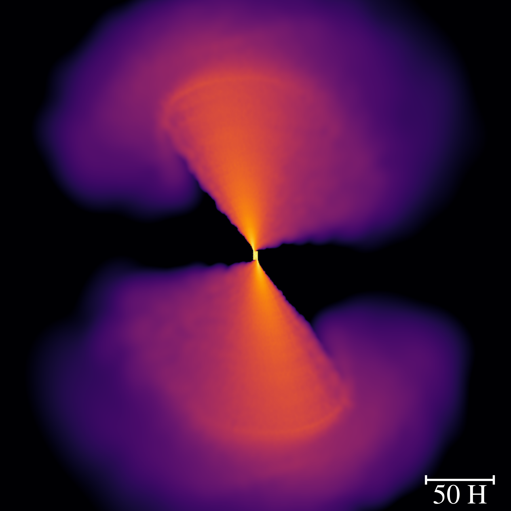
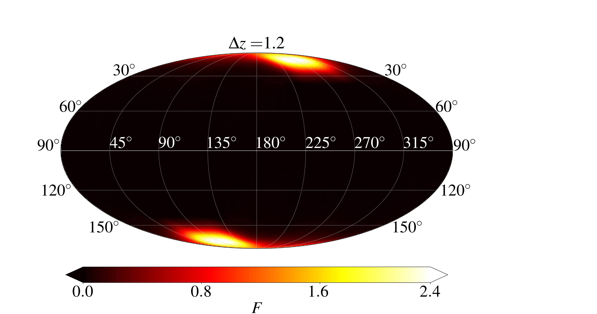

#  Outflow from the spin-induced offset stream self-crossing shocks in TDEs

<div id="top"></div>
<!--
*** README template is from: https://github.com/othneildrew/Best-README-Template
-->


<!-- PROJECT SHIELDS -->
<!--
*** I'm using markdown "reference style" links for readability.
*** Reference links are enclosed in brackets [ ] instead of parentheses ( ).
*** See the bottom of this document for the declaration of the reference variables
*** for contributors-url, forks-url, etc. This is an optional, concise syntax you may use.
*** https://www.markdownguide.org/basic-syntax/#reference-style-links
-->
 <!-- [![Contributors][contributors-shield]][contributors-url]
[![Forks][forks-shield]][forks-url]
[![Stargazers][stars-shield]][stars-url]
[![Issues][issues-shield]][issues-url]
  [![MIT License][license-shield]][license-url]
  [![LinkedIn][linkedin-shield]][linkedin-url] -->


<!-- PROJECT LOGO -->
<br />
<div align="center">
  <a href="https://github.com/othneildrew/Best-README-Template">
    
       

  </a>

  <h3 align="center">Spin-induced offset stream self-crossing shocks in tidal disruption events</h3>

  <p align="center">
    Calculate the outflow from the self-crossing shock like never before!
    <br />
     <!-- <a href="https://github.com/othneildrew/Best-README-Template"><strong>Explore the docs »</strong></a>  -->
    <br />
    <br />
   <!-- <a href="https://github.com/othneildrew/Best-README-Template">View Demo</a>  -->

[Report a bug](https://github.com/tajjankovic/Spin-induced-offset-stream-self-crossing-shocks-in-TDEs/issues).

  
 <!--   <a href="issues">Request Feature</a>  -->
  </p>
</div>


<!-- TABLE OF CONTENTS -->
<details>
  <summary>Table of Contents</summary>
  <ol>
    <li>
      <a href="#about-the-project">About The Project</a>
      <ul>
               <li><a href="#installation">Installation</a></li>
      </ul>
    </li>
    <li>
      <a href="#getting-started">Getting Started</a>
      <ul>
               <li><a href="#Built-with">Built With</a></li>
        <li><a href="#prerequisites">Prerequisites</a></li>
      </ul>
    </li>
    <li><a href="#usage">Usage</a></li>
      <ul>
         <li><a href="#basic-steps">Basic Steps</a></li>
         <li><a href="#running-the-program">Running the program</a></li>
      </ul>
    </li>
   <!-- <li><a href="#roadmap">Roadmap</a></li> -->
  <!--   <li><a href="#contributing">Contributing</a></li> -->
  <!--   <li><a href="#license">License</a></li> -->
    <li><a href="#contact">Contact</a></li>
  </ol>
</details>


<!-- ABOUT THE PROJECT -->
## About The Project

<!-- [![Product Name Screen Shot][product-screenshot]](https://example.com)  -->

<!--  In recent years, there have been several studies related to numerical simulations of TDEs ([[1]](#1), [[2]](#2), [[3]](#3), [[4]](#4), [[5]](#5), [[6]](#6)).  -->
After a star is disrupted, the part of the elongated stream of debris that passed the pericenter collides with the still-infalling gas due to the relativistic apsidal precession, leading to a self-crossing shock. For rotating black holes the relativistic Lense-Thirring precession causes a misalignment between the colliding streams. We study the impact of the black hole's spin on the outflow from the self-crossing shock by locally simulating the collision between two streams with widths $H$ offset by a distance $\Delta z$.

We have simulated 19 stream collisions corresponding to values of the offset $\Delta z \in [0, 1.8H]$, with an increment of $0.1H$, and calculated the outflow rate in terms of the polar angle $\theta$ and azimuthal angle $\phi$. This code uses results from our simulations to calculate the normalized mass flux $F$ (normalized by the total outflow rate) along the direction and for $\Delta z$ specified by the user. For values of $\Delta z$ that we have not simulated a stream collision, we implement linear interpolation. More details are available in [OUR PAPER](https://arxiv.org/)


<p align="right">(<a href="#top">back to top</a>)</p>


<!-- ### Built With -->

<!-- This section should list any major frameworks/libraries used to bootstrap your project. Leave any add-ons/plugins for the acknowledgements section. Here are a few examples. -->


### Prerequisites

* Python 3
* [healpy](https://healpy.readthedocs.io/en/latest/)
* [HEALPix](https://healpix.jpl.nasa.gov/)

### Installation


1. Download and extract the .zip of the repository
 
2. Install Python packages
   
<!-- * Instructions for installation on macOS Monterey 12:-->
   ```sh
   pip3 install matplotlib, pandas, healpy, pygeos, basemap

   ```
<!-- * Instructions for installation on Ubuntu 20.04:-->
<!-- * Instructions for installation on Windows 10:-->

                
<p align="right">(<a href="#top">back to top</a>)</p>


<!-- USAGE EXAMPLES -->
## Usage

### Basic steps

What does the code do:
* By default it calculates $F$ for $\theta \in [0,180^\circ]$ and $\phi \in [0,360^\circ]$, saves the values of $\theta$, $\phi$, $F$ to a .txt file and plots a Matplotlib contour of $F$
* Script outflow_parameters.py:
  * Script with paths (for output and input directories) and relevant parameters (for plotting and calculations)
* Script outflow.py:
  * Script for running the code and calculating the normalized mass flux
* Script outflow_plot.py:
  * Script for plotting the data: either a HEALPix map or a Matplotlib contour plot
* User can specify arbitrary values of $\theta$ and $\phi$:
  * Set specific_value = True in the outflow_parameters.py file
  * Change parameters theta_specific, phi_specific in the outflow_parameters.py file
     

### Running the code

* E.g. from the command line for $\Delta z=0.6$ and 1.2:
   ```sh
   python3.8 outflow.py --dz_list 0.6 1.2
   ```


   

<p align="right">(<a href="#top">back to top</a>)</p>


<!-- ROADMAP-->

<!-- See the [open issues](https://github.com/othneildrew/Best-README-Template/issues) for a full list of proposed features (and known issues).


<!-- CONTRIBUTING 
## Contributing

Contributions are what make the open source community such an amazing place to learn, inspire, and create. Any contributions you make are **greatly appreciated**.

If you have a suggestion that would make this better, please fork the repo and create a pull request. You can also simply open an issue with the tag "enhancement".
Don't forget to give the project a star! Thanks again!

1. Fork the Project
2. Create your Feature Branch (`git checkout -b feature/AmazingFeature`)
3. Commit your Changes (`git commit -m 'Add some AmazingFeature'`)
4. Push to the Branch (`git push origin feature/AmazingFeature`)
5. Open a Pull Request

<p align="right">(<a href="#top">back to top</a>)</p> -->


<!-- LICENSE 
## License

Distributed under the MIT License. See `LICENSE.txt` for more information.

<p align="right">(<a href="#top">back to top</a>)</p> -->


<!-- CONTACT -->
## Contact

Taj Jankovič - taj.jankovic@ung.si

Project Link: [https://github.com/tajjankovic/Spin-induced-offset-stream-self-crossing-shocks-in-TDEs](https://github.com/tajjankovic/Spin-induced-offset-stream-self-crossing-shocks-in-TDEs)

<p align="right">(<a href="#top">back to top</a>)</p>


<!-- ACKNOWLEDGMENTS -->
<!-- ## References
<a id="1">[1]</a> 
Bonnerot C., Lu W., 2020, Monthly Notices of the Royal Astronomical Society.

<a id="2">[2]</a> 
Bonnerot C., Lu W., 2020, Monthly Notices of the Royal Astronomical Society.

<a id="3">[3]</a> 
Bonnerot C., Lu W., 2020, Monthly Notices of the Royal Astronomical Society.

<a id="4">[4]</a> 
Bonnerot C., Lu W., 2020, Monthly Notices of the Royal Astronomical Society.

<a id="5">[5]</a> 
Bonnerot C., Lu W., 2020, Monthly Notices of the Royal Astronomical Society.

<a id="6">[6]</a> 
Bonnerot C., Lu W., 2020, Monthly Notices of the Royal Astronomical Society.

<a id="7">[7]</a> 
Bonnerot C., Lu W., 2020, Monthly Notices of the Royal Astronomical Society.

<a id="8">[8]</a> 
Bonnerot C., Lu W., 2020, Monthly Notices of the Royal Astronomical Society.

<a id="9">[9]</a> 
Bonnerot C., Lu W., 2020, Monthly Notices of the Royal Astronomical Society.

 -->


<!-- Use this space to list resources you find helpful and would like to give credit to. I've included a few of my favorites to kick things off!

* [Choose an Open Source License](https://choosealicense.com)
* [GitHub Emoji Cheat Sheet](https://www.webpagefx.com/tools/emoji-cheat-sheet) -->


<!-- MARKDOWN LINKS & IMAGES  -->
<!-- https://www.markdownguide.org/basic-syntax/#reference-style-links 
[contributors-shield]: https://img.shields.io/github/contributors/othneildrew/Best-README-Template.svg?style=for-the-badge

[license-shield]: https://img.shields.io/github/license/othneildrew/Best-README-Template.svg?style=for-the-badge
[license-url]: https://github.com/othneildrew/Best-README-Template/blob/master/LICENSE.txt
[linkedin-shield]: https://img.shields.io/badge/-LinkedIn-black.svg?style=for-the-badge&logo=linkedin&colorB=555
[linkedin-url]: https://linkedin.com/in/othneildrew
[product-screenshot]: images/screenshot.png
-->
